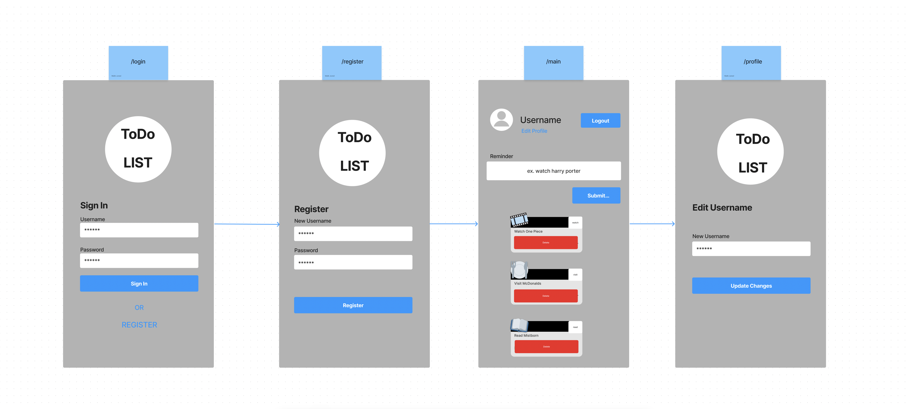
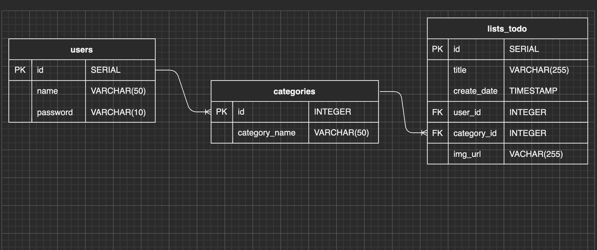
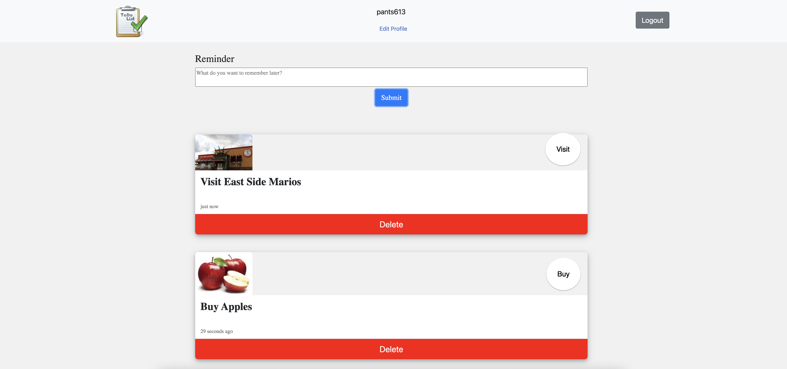

# WELCOME TO Smart TODO List!

Smart TODO List is an application that sorts your reminders for you automitcally! What a relief!

To get started, make sure you are in the directory Smart-ToDo-List, run "run npm local" in your 
terminal, and Visit `http://localhost:3000/` ! 

Have Fun!

# SCREEN SHOTS OF Smart TODO List!

## Dependencies

- Node 10.x or above
- NPM 5.x or above
- PG 6.x
- axios: 0.27.2,
- chalk: 2.4.2,
- cookie-parser: 1.4.6,
- dotenv: 2.0.0,
- ejs: 2.6.2,
- express: 4.17.1,
- morgan: 1.9.1,
- pg: 8.5.0,
- sass: 1.35.1
- nodemon: 2.0.19
